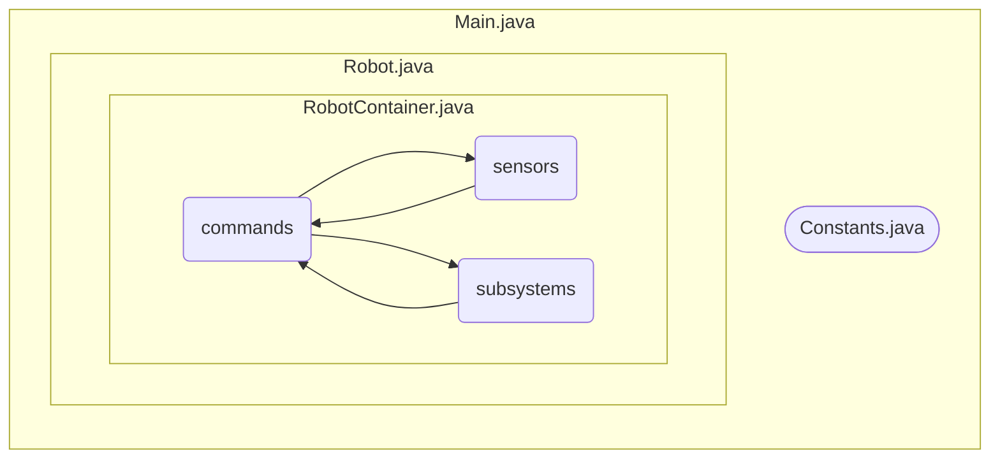

# Top Down Design / Program Structure / Initial Code Generation

[Program Structure](https://docs.wpilib.org/en/stable/docs/software/commandbased/structuring-command-based-project.html)

## Shuffleboard for Debug
How does Romi's Gyro and Accelerometer data show up in the simulator for viewing? Unfortunately, this data is set up just for simulation.  But what if you want to get live data out when you are debugging?

[Shuffleboard](https://docs.wpilib.org/en/stable/docs/software/dashboards/shuffleboard/getting-started/shuffleboard-tour.html) is an application that runs side by side with the FRC Driverstation and allows you to display live data from inside your code.

It does this by interacting with [Network Tables](https://docs.wpilib.org/en/stable/docs/software/networktables/networktables-intro.html) which is kind of like a set of variables any part of your robot can access over ethernet.

### Programming practice: Display Romi's wheel encoder data
1. Using the information from [Displaying Data with Shuffleboard](https://docs.wpilib.org/en/stable/docs/software/dashboards/shuffleboard/getting-started/shuffleboard-displaying-data.html), show the Romi's wheel encoder counts in the simulator.

## Managing Code Libraries
Many component vendors provide software libraries that integrate into WPILib VS Code.  When creating a new project, it is often necessary to install the drivers for certain component.  Here are the instructions for the process: [Managing 3rd Party Libraries](https://docs.wpilib.org/en/stable/docs/software/vscode-overview/3rd-party-libraries.html?highlight=libraries#rd-party-libraries)

### Exercise: Download last season's code from Github
Download a copy of last season's code to your computer for reference: [FRC 2022 Pablo Robotics Code](https://github.com/FRC-Team8744/FRC_Base_2022_3-29_a). Verify that you can build it without library issues.

## Using Robot Builder
1. Open up that folder on your desktop for **WPILib Tools**.
2. Start [Robot Builder](https://docs.wpilib.org/en/stable/docs/software/wpilib-tools/robotbuilder/introduction/robotbuilder-overview.html).
3. Add all components for our skeleton base unit. (4 Victor SPX units - I think)
4. Add a "RunMotor" command.
4. Add a joystick.
5. Add a joystick button for a command trigger (use RunMotor command).
6. Get motors spinning!